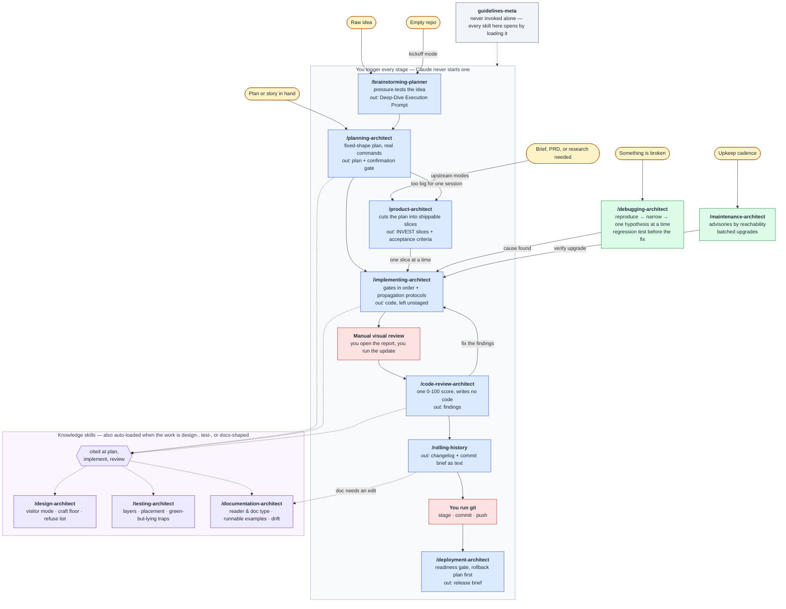

# m-skills — a portable Claude Code plugin

**A simple plugin for full-stack developers who use Claude to do their actual work.** It gives the everyday loop — brainstorm, plan, build, review, write it down — a fixed shape, so the model stops improvising the process and you stop re-typing the same instructions.

Nothing here is tied to a specific project. Every command, framework, and convention is resolved at runtime, so the same skills work in any repo.

### The five commands that are the whole point

Run them in order, one feature at a time. This is 90% of daily use:

| # | Feature stage | Command |
|---|---|---|
| 1 | **Brainstorm** it | `/m-skills:brainstorming-planner` |
| 2 | **Plan** it | `/m-skills:planning-architect` |
| 3 | **Implement** it | `/m-skills:implementing-architect` |
| 4 | **Code review** it | `/m-skills:code-review-architect` |
| 5 | **Document** it | `/m-skills:rolling-history` |

Then you run `git` yourself — the pack never does.

**Everything else is optional and exists for when you hit the thing it's for.** Design work, test strategy, a bug you can't find, a plan too big to ship in one go, docs that have drifted, a release, dependency upkeep — there's a skill for each, and you can ignore all of them until the day you need one. → [Which command do I want?](#which-command-do-i-want)

**Two sections get you going: [Install](#-install) and [Using it, day to day](#-using-it-day-to-day).** Everything after them is detail — read it when you need it, not now.

> **Agent asked to "set up the skills" / "install the template" in a project?** [§ Installation Task](#-installation-task-agent-instructions) is the job.
> **Want to know what each skill does?** [SKILLS_INDEX.md](SKILLS_INDEX.md).

---

## ⚡ Install

```
/plugin marketplace add matis-dev/m-skills
/plugin install m-skills@m-skills
```

That's the whole install — nothing to clone, nothing to copy. It pulls from [github.com/matis-dev/m-skills](https://github.com/matis-dev/m-skills); the full URL works in place of the shorthand, as does a local path if you're running your own fork.

Prefer the terminal? `claude plugin marketplace add matis-dev/m-skills && claude plugin install m-skills@m-skills` does the same thing, and `/plugin update m-skills` (or `claude plugin update m-skills`) picks up new versions later.

Every skill is now a command, in every project:

```
The everyday five:
/m-skills:brainstorming-planner   /m-skills:planning-architect
/m-skills:implementing-architect  /m-skills:code-review-architect
/m-skills:rolling-history

There when you need them:
/m-skills:design-architect        /m-skills:testing-architect
/m-skills:documentation-architect /m-skills:product-architect
/m-skills:debugging-architect     /m-skills:deployment-architect
/m-skills:maintenance-architect
```

They install at user scope, so they're in every project you open — no per-project copying.

**There is no configuration step.** Open a project and the skills work — they read the stack from your lockfile, manifest, and CI config. The first session offers to save what it found to `.claude/PROJECT-PROFILE.md` so nothing has to be re-detected later; decline and everything still works. That file fills in gradually, a section at a time, as you actually use each skill — it is never a form to sit down and complete. → [§ Setting itself up](#-setting-itself-up)

> **Namespacing needs Claude Code ≥ 2.1.216** to autocomplete as `/m-skills:<name>`. On older versions the plugin installs and works, but the menu shows the bare `/<name>` form. `claude --version` to check.

**Only want it in one project?** Clone the repo and copy `skills/` → `<project>/.claude/skills/`, then drop the `m-skills:` prefix from every command. Worth it only when a project needs a modified copy — project skills silently override bundled ones of the same name, which the plugin route can't do.

---

## 🔄 Using it, day to day

You name a skill, it runs that one stage and stops. Nothing chains itself, and nothing touches git.

Commands below use the plugin form — in copy mode, drop the `m-skills:` prefix.

### Which command do I want?

**The everyday loop — one feature, in order.** If you only ever use these five, the pack has done its job.

| # | Situation | Command |
|---|---|---|
| 1 | Idea needs pressure-testing | `/m-skills:brainstorming-planner` → emits a Deep-Dive Execution Prompt |
| 2 | Prompt (or a request) needs a plan | `/m-skills:planning-architect` → fixed-shape plan, real commands, confirmation gate |
| 3 | Plan approved, build it | `/m-skills:implementing-architect` → gates + propagation protocols, stops on visual diffs |
| 4 | Read before staging | `/m-skills:code-review-architect` → one 0–100 score, writes no code |
| 5 | Feature done, write it down | `/m-skills:rolling-history` → changelog + commit brief as text |

**The rest — reach for one when you hit the thing it's for.** No order, no obligation.

| Situation | Command |
|---|---|
| Starting a project from nothing | `/m-skills:brainstorming-planner kickoff` → what to build, first slice, foundational decisions routed to their owners |
| Screen or component to design | `/m-skills:design-architect` → visitor mode, craft floor, refuse list |
| Tests to add or upgrade | `/m-skills:testing-architect` |
| Something is broken | `/m-skills:debugging-architect <symptom>` → reproduce, narrow, one hypothesis at a time, regression test before the fix |
| Plan is too big to ship in one go | `/m-skills:product-architect — decompose` → vertical slices, INVEST, acceptance criteria |
| PRD, product brief, or research plan needed | `/m-skills:product-architect — prd \| brief \| research` |
| README, guide, or API reference to write or fix | `/m-skills:documentation-architect` → reader + doc type, runnable examples, drift check |
| Ready to ship | `/m-skills:deployment-architect <env>` → release brief, rollback plan, post-deploy checks |
| Upkeep, advisories, upgrades | `/m-skills:maintenance-architect` → triaged by reachability, batched so a break is attributable |
| Fast feedback mid-work | `bash <skills>/implementing-architect/check-quality.sh` |

`guidelines-meta` is never invoked alone — every other skill opens by loading it.

### The whole flow, in one picture



**Reading it:** solid arrows are steps *you* fire; dotted arrows are knowledge loaded for you. The two red boxes are what the pack deliberately refuses to automate — **visual review** and **git** are yours, always. `debugging-architect` is entered from any stage, not only from the start, and `maintenance-architect` runs on a cadence rather than on discovery.

### Or just say it in your own words

The verbose prompts you've been pasting still work verbatim — but each maps to a command plus a plain-language modifier. Modifiers are interpreted per **Guidelines §19**, so the same phrase means the same thing in every skill.

| What you used to paste | Now |
|---|---|
| "Please use /brainstorming-planner skill to help me come up with a clear instruction…" | `/m-skills:brainstorming-planner <the idea>` |
| "PROCEED and IMPLEMENT it… but wait with the testing before I confirm" | `/m-skills:implementing-architect <plan> — tests later` |
| "Please take this story and IMPLEMENT it" | `/m-skills:implementing-architect <story>` |
| "CODE REVIEW of uncommitted changes… Skip testing, I just finished it in the other session" | `/m-skills:code-review-architect — skip gates` |
| "Make sure CHECK QUALITY runs green… coverage stays above 80… e2e passes" | `/m-skills:testing-architect — make gates green, hold coverage at 80` |
| "Please FIX the findings" | `/m-skills:implementing-architect — fix the findings` |
| "Run /rolling-history, skip the tests, already handled" | `/m-skills:rolling-history — skip gates` |
| *(new)* design or audit a screen | `/m-skills:design-architect <target> — audit` |
| *(new)* check a release is safe without shipping | `/m-skills:deployment-architect prod — prepare only` |
| *(new)* something broke in prod | `/m-skills:deployment-architect — roll back` |
| *(new)* brand-new empty project | `/m-skills:brainstorming-planner kickoff` |
| *(new)* "why is this failing?" | `/m-skills:debugging-architect <symptom>` |
| *(new)* a test fails intermittently | `/m-skills:debugging-architect <test> — flaky` |
| *(new)* security advisory landed | `/m-skills:maintenance-architect — advisories only` |
| *(new)* "the README lies / nobody can set this up" | `/m-skills:documentation-architect — audit` |
| *(new)* write the API reference | `/m-skills:documentation-architect <module> — reference` |

**The modifier contract:** a modifier narrows scope, never the honesty bar. "Skip gates" means the output says *"gates not run this session; reported green by the user"* — it never prints a ✅ nobody observed. And no phrasing unlocks git: "ship it", "commit it", "just push" all still stop at unstaged files.

---

## 🔒 The non-negotiables

These hold in every skill, in every project:

1. **No git automation.** No staging, committing, pushing, branching, tagging, `--no-verify`, or force ops. Files stay unstaged — even when you say "ship it".
2. **No auto-updating golden files or visual baselines.** The diff gets surfaced with its report path; the update command is yours.
3. **Tests ship with the code.** No "tests TBD".
4. **Honest output.** Every number, path, and command is one that was read or run. A placeholder beats a plausible invention.
5. **Bounded verification.** Build → one batched inspection → one fix batch → at most one confirm round → stop.
6. **Never weaken a test to get it green.**

---

## 📦 What's in here

| Path | What it is | Goes where |
|---|---|---|
| `.claude-plugin/plugin.json` | Plugin manifest | stays put — read on install |
| `.claude-plugin/marketplace.json` | Single-plugin marketplace catalog | stays put — read by `/plugin marketplace add` |
| `hooks/hooks.json` | Wires both SessionStart hooks | stays put |
| `scripts/profile-bootstrap.sh` | Detects the stack when no profile exists yet | stays put |
| `scripts/adhd-always-on.sh` | Applies the reply protocol session-wide when its flag is set | stays put |
| `tests/run-tests.sh` | The pack's own test suite — 128 assertions, no dependencies | stays put |
| `skills/` | The 13 skills | plugin: stays put · copy-mode: → `<project>/.claude/skills/` |
| `skills/guidelines-meta/PROJECT-PROFILE.template.md` | The profile the skills fill in as you work | → `<project>/.claude/PROJECT-PROFILE.md` |
| `CLAUDE.template.md` | Always-on guards, loaded every session | → `<project>/CLAUDE.md` |
| `settings.template.json` | Permission allowlist + git denylist | → `<project>/.claude/settings.local.json` |
| `skills/implementing-architect/check-quality.sh` | Runnable gate pipeline (auto-detects) | ships inside `skills/` |
| `SKILLS_INDEX.md` | Skill catalog, pipeline diagram, provenance | reference |

The 13 skills: `guidelines-meta`, `brainstorming-planner`, `planning-architect`, `product-architect`, `design-architect`, `testing-architect`, `implementing-architect`, `debugging-architect`, `code-review-architect`, `documentation-architect`, `rolling-history`, `deployment-architect`, `maintenance-architect`.

**Who invokes what** — pipeline stages are yours to trigger; knowledge skills load themselves when relevant:

| Skill | Invocation |
|---|---|
| `brainstorming-planner`, `planning-architect`, `product-architect`, `implementing-architect`, `debugging-architect`, `code-review-architect`, `rolling-history`, `deployment-architect`, `maintenance-architect` | `disable-model-invocation: true` — **you** trigger them, Claude never starts one on its own |
| `design-architect`, `testing-architect`, `documentation-architect` | Both — you can call them, and Claude loads them when the work is design-, test-, or docs-shaped |
| `guidelines-meta` | `user-invocable: false` — background knowledge, loaded by the other skills, hidden from the `/` menu |

---

## 🔧 Setting itself up

### The profile, filled as you go

**The profile is progressive, not a questionnaire.** It is never "finished", and a half-filled one is the normal state — most of it *cannot* be known at install time. A project with no UI has no design system; one that has never shipped has no rollback mechanism; an empty repo has no commit convention.

So each section is owned by the skill that needs it, and gets filled the first time that skill runs:

| Profile section | Owner | Filled when |
|---|---|---|
| Identity, Commands | SessionStart hook | first session — auto-detected |
| Conventions | `implementing-architect` / `testing-architect` | first code or tests |
| Design | `design-architect` | first UI work |
| Documentation Targets, Commit Convention | `rolling-history` | first changelog entry |
| Documentation Standards | `documentation-architect` | first doc written or audited |
| Product Definition | `product-architect` | first time work is specified or sliced |
| Deployment | `deployment-architect` | first deploy, or first "is this ready?" |
| Guardrails, Propagation Sites | any skill — chiefly `debugging-architect` | whenever something is learned the hard way |
| Packages *(monorepos)* | whichever skill first works in a package | resolved from the paths being touched |

A skill fills **only its own** section, in at most 3–4 questions, and never front-loads questions for work that isn't happening yet. An unknown row is `n-a`, `TODO`, `pending: <when>`, or `assumed: <value>` — never blank and never invented.

**On a brand-new project** the hook detects that there's nothing to detect (fewer than three source files) and offers a conversation rather than a form:

> *"Project looks new — want to start with `/m-skills:brainstorming-planner kickoff`?"*

**Kickoff Mode** is the greenfield entry point. It establishes what's being built and for whom, identifies the smallest genuinely useful slice, routes each foundational decision to the skill that owns it, defers everything else as `pending`, and ends with a plan for that first slice. Setup falls out of the conversation instead of preceding it.

Five questions maximum before it starts proposing — a wrong default is cheap to change on day one, and proposing-then-being-corrected beats interrogating someone into boredom. Greenfield rows get **decided**, not discovered, and `design-architect` on a project with no interface runs in **Establish** mode: it decides the visual world rather than matching one that doesn't exist.

Declining is a first-class outcome. If you'd rather just start coding, the owning skills ask when they actually need something.

**On an established project the order is investigate → then ask.** The hook sweeps for structural evidence — repo shape, where tests live and how many, styling and design-token files, deployment config (`Dockerfile`, `vercel.json`, `fly.toml`, `k8s/`, a CI workflow named deploy…), the env contract (`.env.example`), docs, commit config — and hands Claude pointers rather than conclusions. Claude then **opens those files** and fills everything the code answers.

Only what the repo genuinely cannot say gets asked, and it's a short list: intent, who's allowed to fire a production deploy, where production secrets live, the coverage bar the team wants, the rollback they'd actually perform. **Asking about something the repo already answers is treated as a defect** — as is writing `pending` on a row whose answer was sitting in an unopened file.

| Situation | Behavior |
|---|---|
| Profile already exists **and still true** | **Silent.** No output, no cost. |
| Profile exists but has drifted | Names the specific stale rows and offers to fix only those |
| Not a project directory | **Silent.** Never nags in scratch folders. |
| `.claude/.m-skills-no-bootstrap` present | **Silent** forever. |
| Brand-new project | Says what little is knowable, then offers `brainstorming-planner kickoff` — never a questionnaire |
| Established project, no profile | Sweeps for structural evidence (~0.5s), Claude reads the files it points at, then asks only the residue |

**It does not write files by default** — it proposes, you decide. `M_SKILLS_AUTOPROFILE=1` writes a draft instead; detected rows filled, everything else marked.

> **Why `SessionStart` and not install-time:** the `Setup` hook event only fires on `claude --init` / `--maintenance`, not on `/plugin install`. `SessionStart` is what actually runs when you open a project — and it's the right place anyway, since the plugin installs once while the profile is per-project and grows over months. The `Setup` event is wired to the same script so `claude --init` works in CI.

### Monorepos

A repo with several packages usually has several *stacks*. The hook enumerates workspace packages (pnpm / turbo / nx / lerna / npm-yarn workspaces / go.work) rather than just noting that a monorepo exists, and the profile carries a §Packages table for what differs. Skills then **resolve the package from the paths they're touching**, read its rows first, and fall back to the shared rows — with a change spanning packages taking the **union** of their constraints, not the loosest. If one package requires an a11y gate, a change touching it runs that gate even though its sibling has none.

### Session-wide reply protocol

`guidelines-meta` §17 (the reply protocol — lead with the action, numbered steps, one next step, cap lists at five, no preamble, plus a pre-send check) applies whenever a pack skill is running. To apply it to **everything** — ordinary questions, debugging, anything that never touches a skill — create a flag file. A second `SessionStart` hook (`scripts/adhd-always-on.sh`) then injects §17 each session. Opt-in only: no flag, silent exit, 25ms.

| Flag file | Scope |
|---|---|
| `~/.claude/.m-skills-adhd-always` | Every project |
| `.claude/.m-skills-adhd-on` | This project only |

It fires on `startup`, `resume`, **`clear`, and `compact`** — a context clear is exactly where a session-only setting lapses without you noticing, which is the working-memory tax §17 exists to remove. "Stop adhd mode" turns it off for the current session without touching the flag.

There is no `/i-have-adhd` command, deliberately: an output style is influence, not something to remember to invoke.

---

## 🎯 The design in one paragraph

Skills name **roles**, never commands. Where an ordinary skill would hardcode `npm run lint`, these say `<lint>` and resolve it — from `.claude/PROJECT-PROFILE.md` if it exists, otherwise by auto-detecting from `package.json` / `Makefile` / `pyproject.toml` / `Cargo.toml` / `go.mod` / CI config. **A role with no command is `n-a`, never invented.** Same for conventions: instead of "use DaisyUI", the rule is "use the project's committed design system, read from the profile". Every concrete tool or filename that appears in a skill is explicitly labeled a disposable illustration of a category — so the pack doesn't rot into a catalogue of one codebase's details.

---

## 🚀 Installation Task (agent instructions)

**Goal:** a target project where the skills are invocable, the profile is filled with *verified* values, and the guards load every session.

### Step 1 — Get the skills in place

**Default route — install from the public repo.** Check `claude plugin list` for `m-skills` first; if it's absent, install it:

```
claude plugin marketplace add matis-dev/m-skills
claude plugin install m-skills@m-skills
```

The commands are then available as `/m-skills:<name>` in every project, and there is no `skills/` copy to make. Steps 2–5 still apply — the profile is per-project regardless.

**Fallback — copy into the project** (only when it needs a modified copy, or the machine is offline). Clone `https://github.com/matis-dev/m-skills`, then:

```
<pack>/skills/                 → <project>/.claude/skills/
<pack>/CLAUDE.template.md      → <project>/CLAUDE.md              (merge if one exists — never overwrite)
<pack>/settings.template.json  → <project>/.claude/settings.local.json  (merge if one exists)
```

`CLAUDE.md` and `settings.local.json` are copied in **both** modes — the plugin ships skills, not project guards. Get them from the clone, or from the installed plugin under `~/.claude/plugins/`.

If `<project>/CLAUDE.md` already exists, **merge**: add the guards and conventions sections, keep everything the project already documented. Same for `settings.local.json` — union the `allow` lists, keep the `deny` list.

### Step 2 — Detect the project's reality

Read, don't assume. In this order:

1. **Package manager** — from the lockfile: `pnpm-lock.yaml` → pnpm, `yarn.lock` → yarn, `bun.lock*` → bun, else npm. Non-JS: `uv.lock` / `poetry.lock` / `Cargo.toml` / `go.mod` / `Makefile`.
2. **Gate commands** — the manifest's script block, or Make targets, or the language's standard tooling.
3. **CI config** (`.github/workflows/*`) — the gates CI actually runs are the gates that matter. If CI runs something the manifest doesn't expose, CI wins.
4. **Test layers** — which frameworks are installed, and where existing tests live (beside the source? a mirrored tree?). Open one existing test and match its style.
5. **Design system** — the component library, token file, or styling convention actually in use. Open one existing component.
6. **Doc targets** — which of changelog / README / architecture / deployment / API / test docs exist, and at which paths.
7. **Commit convention** — from a commitlint/husky config if present, else infer from `git log --oneline -30`. Record the **subject case** exactly; getting this wrong makes every commit bounce.
8. **Blind spots** — what a green pipeline does *not* prove here (e.g. type-check not covering template/markup bindings; visual baselines passing for a consistently-broken resource).

### Step 3 — Write the profile

Fill `<project>/.claude/PROJECT-PROFILE.md` from the template. Rules:

- **Only values you verified.** A command you didn't find in a real file does not go in the file.
- **Absent gate → `n-a`.** Do not invent a script name to fill a row.
- **Leave "Recurring Propagation Sites" empty** on day one. It gets one line each time a change lands somewhere the gates didn't catch — after a month it's the most valuable section in the file.

### Step 4 — Verify

1. Run `check-quality.sh --list` — prints what it resolved, runs nothing. Every row should match the profile or read `n-a`.
   - plugin mode: `bash ${CLAUDE_PLUGIN_ROOT}/skills/implementing-architect/check-quality.sh --list`
   - copy mode: `bash .claude/skills/implementing-architect/check-quality.sh --list`
2. Run one cheap gate (usually `<lint>`) to confirm the command is real.
3. Confirm the skills are discoverable — copy mode: each `SKILL.md` has `name` + `description` frontmatter at `.claude/skills/<name>/SKILL.md`. Plugin mode: `claude plugin list` shows `m-skills` enabled.

### Step 5 — Report

State: files written, gates resolved (with commands), gates marked `n-a` and why, anything you could not determine and need the user to confirm. Do not claim a gate works if you didn't run it.

### Guards during installation

- **Never run `git add`, `git commit`, `git push`, `git checkout`, `git switch`, `git tag`, or any force op.** Leave everything unstaged. This holds for the install itself.
- **Never overwrite an existing `CLAUDE.md` or `settings.local.json`** — merge.
- **Never install a dependency** as part of setup.
- **Never fabricate** a command, path, or convention to make the profile look complete.

---

## 📝 Copy-paste prompt

Hand this to an agent in the project you want set up — it needs nothing else, not even a clone:

```
Install the m-skills pack into this project.

1. If `claude plugin list` doesn't show m-skills, install it from the public repo:
     claude plugin marketplace add matis-dev/m-skills
     claude plugin install m-skills@m-skills
   Only copy `skills/` → `.claude/skills/` instead if I've said I want a project-local
   modified copy.
2. Either way, merge `CLAUDE.template.md` into `./CLAUDE.md` and `settings.template.json` into
   `.claude/settings.local.json` — never overwrite what's already there. Both files ship with
   the plugin (`~/.claude/plugins/`) as well as in the repo.
3. Detect this project's real stack: package manager from the lockfile, gate commands from the
   manifest and CI config, test layers and file placement from an existing test, design system from
   an existing component, doc paths by looking, commit convention from the commitlint config or
   `git log`. Read, don't assume.
4. Write `.claude/PROJECT-PROFILE.md` from
   `skills/guidelines-meta/PROJECT-PROFILE.template.md` using only values you verified.
   A gate that doesn't exist is `n-a` — do not invent script names.
5. Verify with `check-quality.sh --list`, then run the lint gate once to prove it's real.
6. Report what you wrote, what resolved, what's `n-a`, and what you need me to confirm.

Do not run any git command that mutates state. Leave everything unstaged.
```

---

## 🧪 Testing the pack itself

```
bash tests/run-tests.sh        # 128 assertions, ~2s, no dependencies
bash tests/run-tests.sh -v     # show every passing assertion
RUN_EVALS=1 bash tests/run-tests.sh   # adds model-in-the-loop checks (costs tokens)
```

Three layers, cheapest first:

1. **Structure** — frontmatter matches directory names, invocation flags are what they should be, no skill references a sibling by hardcoded path, every internal link resolves, doc skill-counts match reality, manifests are valid JSON and agree on version, `claude plugin validate --strict` passes.
2. **Behaviour** — the scripts against real fixture projects: gate resolution across pnpm/npm/Rust/empty, config-overrides-detection, `--list` executing nothing, all four silence conditions, the greenfield/brownfield boundary, `node_modules` exclusion, the structural sweep, drift detection and its false-positive guards, §17 extraction boundaries.
3. **Eval** — opt-in, model-in-the-loop. Checks that a skill's non-negotiables survive contact with a real model (asked to "commit it for me", does it still refuse?). `claude plugin eval` will replace this layer once it's generally available; it isn't in 2.1.158.

The suite is **mutation-tested** — reintroducing the `eval`/`find` bug, the wrong pnpm audit flag, dropping a `disable-model-invocation` flag, or deleting a load-bearing rule (the 3-hypothesis ceiling, rollback-before-deploy, never-weaken-a-test, no-upgrade-with-refactor) each make it fail. A suite that can't fail is decoration.

That last group exists because those four rules are the ones whose removal makes a skill *dangerous* rather than merely worse, and prose has no compiler. An earlier version of that check passed on the version footer instead of the actual constraint — so each is now anchored to its numbered line.

---

## 🔗 What this pack absorbed, and from where

**Everything here is influence, not inventory.** No source ships as a separate command — each is folded into the skill that had the gap, so the surface stays at nine skills no matter how many sources get absorbed. Every source is credited with its real link and its actual license.

The point of absorbing rather than stacking: these sources cover blind spots in the pipeline skills. A planning skill has no opinion about contrast ratios; a review skill has no opinion about how its own findings should be shaped. Folding the answer into `guidelines-meta` or `design-architect` means every skill inherits it without anyone invoking anything.

| Source | License | Folded into | What was taken |
|---|---|---|---|
| **[Andrej Karpathy — notes on agent coding](https://x.com/karpathy/status/2015883857489522876)** | n/a — public post | `guidelines-meta` **Part A** | The four behavioral rules: surface assumptions before coding, minimum code that solves the problem, surgical edits only, and give success criteria rather than instructions. |
| **[ayghri/i-have-adhd](https://github.com/ayghri/i-have-adhd)** | MIT | `guidelines-meta` **§17** (+ optional session-wide hook) | The whole ruleset: five cognitive facts, ten rules, the forbidden opener/recap/closer lists, six break-the-rules cases, and the pre-send check. |
| **[JuliusBrussee/caveman](https://github.com/JuliusBrussee/caveman)** | none declared | `guidelines-meta` **§17** | The compression half of the reply protocol — drop filler, hedging, and pleasantries while leaving code, commits, and security warnings uncompressed. |
| **[DietrichGebert/ponytail](https://github.com/DietrichGebert/ponytail)** | MIT | `guidelines-meta` **§2** | The Laziness Ladder — does it need to exist at all → stdlib → native/framework → installed dependency → one clear line → only then new code. |
| **[`code-simplifier` agent, anthropics/claude-code](https://github.com/anthropics/claude-code/blob/main/plugins/pr-review-toolkit/agents/code-simplifier.md)** | none declared | `guidelines-meta` **§2** | No nested ternaries; preserve behavior exactly when simplifying — change how, never what; don't trade debuggability for fewer lines. |
| **[pbakaus/impeccable](https://github.com/pbakaus/impeccable)** | Apache 2.0 | [`design-architect`](skills/design-architect/SKILL.md) §1–2 · `guidelines-meta` **§16** | Visitor modes (Persuade / Operate / Read / Experience), the craft floor, the browser-surfaces insight, brief-wins, refinement-vs-redesign, and "verify in bounded passes, not a loop". |
| **[nutlope/hallmark](https://github.com/nutlope/hallmark)** | MIT | [`design-architect`](skills/design-architect/SKILL.md) §3–5 · `guidelines-meta` **§15, §18** | The refuse list and slop gates, structural-fingerprint variety, token discipline, redrawn-chrome and glyph-icon tells, "no invented metrics", and the six-axis pre-emit self-critique. |
| **[`code-review` plugin, anthropics/claude-code](https://github.com/anthropics/claude-code/tree/main/plugins/code-review)** | none declared | [`code-review-architect`](skills/code-review-architect/SKILL.md) §7 | The confidence gate — post only findings you'd rate ≥ 80, plus the explicit false-positive filter list. |
| **[`security-guidance` plugin, anthropics/claude-code](https://github.com/anthropics/claude-code/tree/main/plugins/security-guidance)** | none declared | [`code-review-architect`](skills/code-review-architect/SKILL.md) Phase 4 · [`testing-architect`](skills/testing-architect/SKILL.md) §2 | The threat model by sink category — injection, unsafe deserialization, insecure DOM APIs — plus the loop-closer: every finding becomes a failing-first regression test. |

The two design sources overlap deliberately — impeccable is stronger on *what to verify on the built result*, hallmark on *what to refuse before you build it*. Both are distilled to rules about the rendered output, so they apply on any stack rather than only the one they shipped for.

**On the licenses:** `caveman` and the Anthropic plugins carry no declared SPDX license, so what's absorbed from them is the *idea* — restated in this pack's own words — not copied text. The MIT and Apache sources permit reuse and are credited accordingly; `i-have-adhd` is the one whose structure is followed closely, and it's MIT.

### If you ever want a source's full surface

Any of these installs standalone and coexists with this plugin — namespacing keeps commands distinct. Worth it only when you want their *tooling*, not their judgment: impeccable ships 23 sub-commands, a 59-rule deterministic detector, and live browser iteration; hallmark ships 21 themes and a study/DNA-extraction workflow; `security-guidance` runs real-time pattern matching on every edit, which no amount of written guidance replicates. What's absorbed here is the judgment. `i-have-adhd` is the one never worth installing alongside — §17 is already its full ruleset, so you'd just get it twice.
